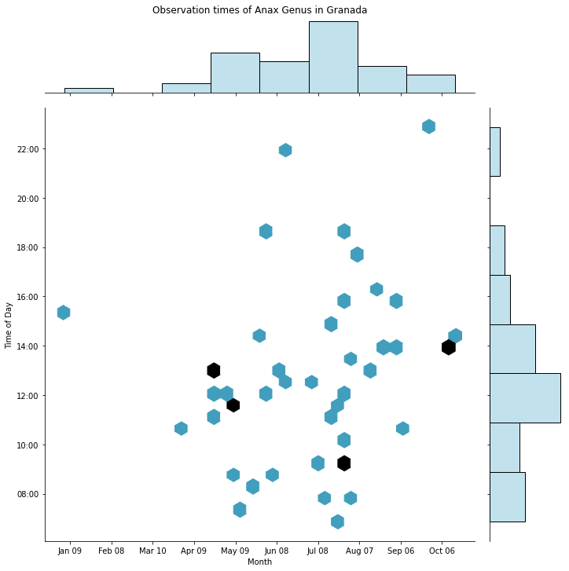

# Macro-Photography planner
A quick project to gather data from iNaturalist and planning my macrophotography trips.
Mainly based on the [Pyinaturalist package](https://pyinaturalist.readthedocs.io/en/stable/index.html).

## Generate summary of observations 
This is useful to know best dates and time of the day to take photos. 

## Generate a map of observations
Useful to know where that insects are usually observed.

## Version
0.1.0

## Roadmap
It currently support 1 species, but the plan is to add multiple species in the same query.
Plotting GPS data

## Links
- [pyinaturalist](https://pyinaturalist.readthedocs.io/en/stable/index.html)
- [inaturalist](https://www.inaturalist.org/)